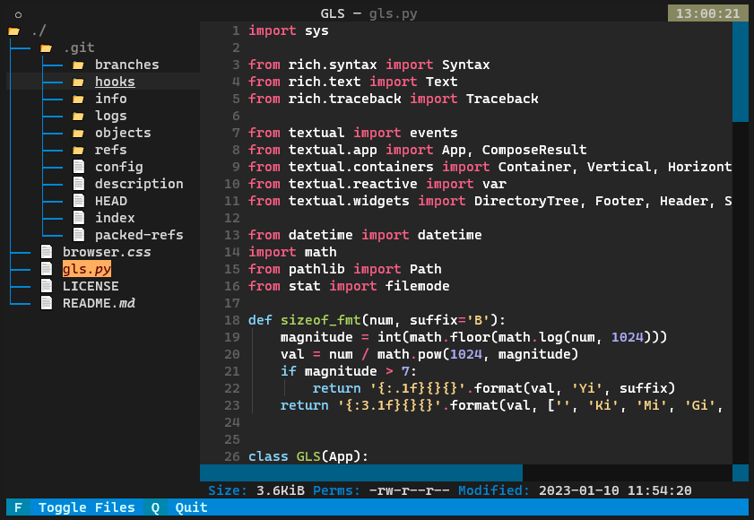

# gls - Graphical List Directory

Simple file browser for the terminal with code highlighting and basic file information.

This new version drops all the previous custom-code in favor of a simple built-in feature from [Textual: Code Browser](https://github.com/Textualize/textual).



Additional info:
- Size.
- File permissions.
- Last modification timestamp.

## Installation
```bash
git clone https://github.com/albertpuente/gls.git && cd gls
pip install -r requirements.txt

# Change python to your binary if needed (e.g. python3)
echo "alias gls=\"python $PWD/gls.py\"" >> ~/.bashrc && source ~/.bashrc
```
## Usage

```bash
gls  # Uses current dir
gls /path/to/folder  # Specific dir
```

## Next (nice to have)
- Built-in file edit (nano, vim, emacs...)
- File management (move, copy, delete).
- SSH support.
